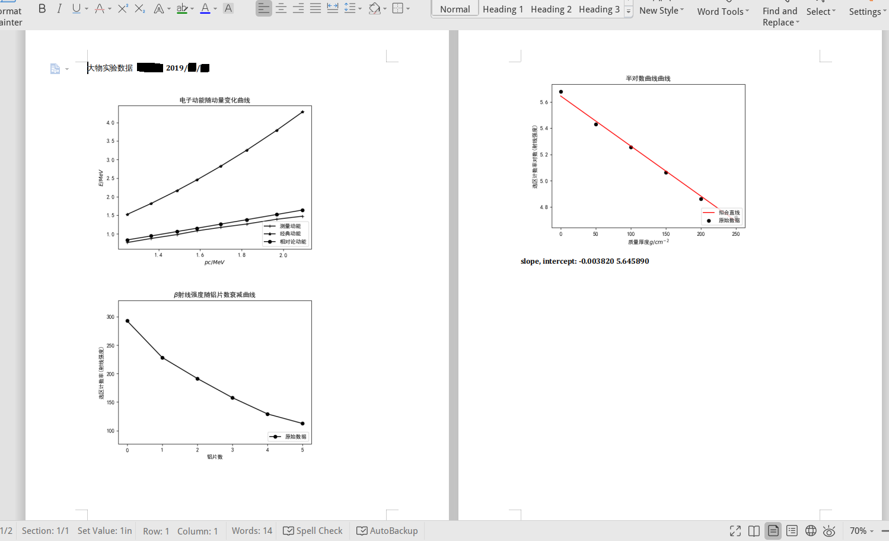
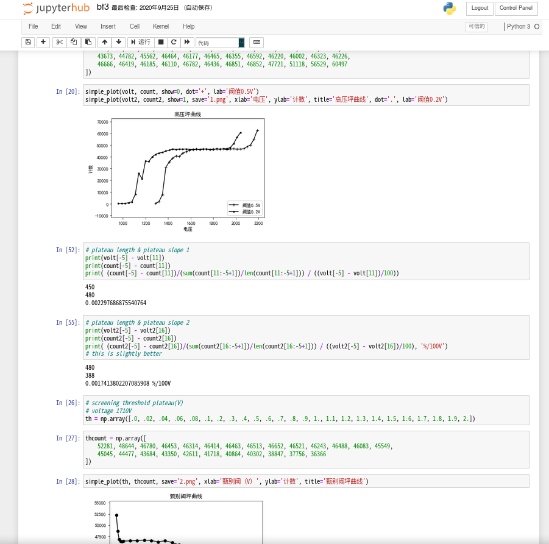

# PhysicsExp
### USTC Physics Experiments Data Processing Tools

### 中科大大物实验数据处理工具

> *The package is also released on [pypi](https://pypi.org/project/physicsexp/).*

> *For readers from pypi, [here](https://github.com/regymm/PhysicsExp) please.*

> 关于本人的实验数据和数据处理脚本、图片、计算结果（从一级到四级），请见 [USTCPhysExpData](https://github.com/regymm/USTCPhysExpData) 项目。
> My experiment data, data processing scripts, figures, and some results(from experiment level I to IV), please visit the [USTCPhysExpData](https://github.com/regymm/USTCPhysExpData) project. 

## About

Don't want to use OriginLab or Excel? Try Python!  

~~最终目的是建造一套用于自动化处理大物实验数据、绘制图像、生成可打印文档、将文档提交到在线打印系统的工具；针对常用数据处理需求实现简化和自动化，只要简单的几行代码，就能完成通用的绘图、拟合、不确定度计算等大物实验常用任务。~~


理想与现实差距还很大，目前仅仅包装了matplotlib绘图库、简单拟合、文件输入、docx生成，简化重复劳动。

Now I only wrapped matplotlib plotting library, implemented simple regression, easy file input, and `docx` generation. To simplify repetious works. 

相关博客：[USTC LUG上的页面](https://lug.ustc.edu.cn/planet/2021/01/physexp-using-python/) [本人主页上的页面](https://regymm.github.io/MyBlog/experience/2021/01/25/ustc-physexp-using-python.html)


## Installation

**Install the package**

 Use TUNA mirror to accelerate. Depencencies like numpy and matplotlib will be installed automatically. 

```
pip install -i https://mirrors.tuna.tsinghua.edu.cn/pypi/web/simple physicsexp
```

**Test the installation(Optional)**

```
>>> from physicsexp.mainfunc import *
>>> from physicsexp.gendocx import *
>>>
```

If no error then you are ready! If error occurs feel free to open an issue.

**Run the example script(Recommended)**

```
python3 ./physicsexp/example/plot.py
```

You'll see graphs poped out and saved to .png, a generated gen.docx ready to print, and calculations printed to output, in the `./physicsexp/example` directory. You can also clone USTCPhysExpData to try some real-life cases. Then you can modify the code or write your own code to process your data!

**Configure font on macOS or Linux**

See (https://zhuanlan.zhihu.com/p/40931776)[https://zhuanlan.zhihu.com/p/40931776].

Notice that the cache file of matplot may differ according to your OS.

## Example Script Explained

It is a real-case example of input several lines of data, plot the data and do linear regression, and generate a printable docx document containing plot and analyse results. 

If you really want to know, the experiment is about verifying the relativistic kinetic energy vs. momentum relationship of electron(beta-ray) and measuring the extraction of beta-ray by aluminum pieces of different thickness. 

**First, put your data in `data.txt`**, like this:

```
# 位置x
e -2
23.     24.2    25.5    26.5    27.7    29.     30.5    31.8
# 峰位N
245.77  291.79  336.40  378.52  417.94  456.14  510.12  544.95
# 铝片数量M
0       1       2       3       4       5
# 选区计数N
43901   34258   28725   23670   19386   16866
```

You can use `#` to add some comment lines, and `e *` to specify the order of magnitude -- thus be able to directly write down the original on-paper data without conversion. 

**Then it's time to write python**

Headers & imports

```python
#!/usr/bin/env python3
# -*- coding: utf-8 -*-

from physicsexp.mainfunc import *
from physicsexp.gendocx import *
```

Read the file easily with the `readoneline` function

```python
fin = open('./data.txt', 'r', encoding='utf-8')
pos = readoneline(fin)
N = readoneline(fin)
Al_num = readoneline(fin)
Cnt = readoneline(fin)
fin.close()
```

Calculate and print some results. This is python, you can do whatever you like easily. (This part is not related to the library, you can skip this)

```python
a = 2.373e-3
b = -.0161
dEk = .20

c0 = 299792458.
MeV = 1e6 * electron

Emeasure = a * N + b + dEk
x0 = .10
R = (pos - x0) / 2
B = 640.01e-4
Momentum = 300 * B * R
Eclassic = ((Momentum * MeV)**2 / (2 * me * c0**2)) / MeV
Erela = np.array([math.sqrt((i * MeV)**2 + (me * c0**2)**2) - me * c0**2 for i in Momentum]) / MeV
print('pos\t', pos)
print('R\t', R*100)
print('pc\t', Momentum)
print('N\t', N)
print('Eclas\t', Eclassic)
print('Erela\t', Erela)
print('Emes\t', Emeasure)
```

**Now, plot!**

First graph: three curve in one figure. Using `simple_plot`. You can use LaTeX in plot labels. Graph is saved to `1.png`. Use `show=0` to plot multiple lines on one figure. 

```python
simple_plot(Momentum, Emeasure, show=0, issetrange=0, dot='+', lab='测量动能')
simple_plot(Momentum, Eclassic, show=0, issetrange=0, dot='*', lab='经典动能')
simple_plot(Momentum, Erela, dot='o', save='1.png', issetrange=0, xlab='$pc/MeV$', ylab='$E/MeV$', title='电子动能随动量变化曲线', lab='相对论动能')
```

Second graph, a simple curve, saved to `2.png`:

```python
Len = 150
Cnt = Cnt / Len
simple_plot(Al_num, Cnt, xlab='铝片数', ylab='选区计数率(射线强度)', title='$\\beta$射线强度随铝片数衰减曲线', save='2.png')
```

Third graph, a curve with a linear fit, using `simple_linear_plot`, saved to `3.png`:

```python
CntLn = np.log(Cnt)
d = 50
Al_Real = Al_num * d
slope, intercept = simple_linear_plot(Al_Real, CntLn, xlab='质量厚度$g/cm^{-2}$', ylab='选区计数率对数(射线强度)', title='半对数曲线曲线', save='3.png')
print(-slope)
print(math.log(1e4) / (-slope))
print((math.log(Cnt[0]) - 4 * math.log(10) - intercept) / slope)
```

**Don't bother putting pictures in documents yourself!**

With a single line of code, generate a printable docx document with the above three pictures and the fit results. 

```python
gendocx('gen.docx', '1.png', '2.png', '3.png', 'slope, intercept: %f %f' % (slope, intercept))
```

**Results**

Output:

```
pos	 [0.23  0.242 0.255 0.265 0.277 0.29  0.305 0.318]
R	 [ 6.5   7.1   7.75  8.25  8.85  9.5  10.25 10.9 ]
pc	 [1.2480195  1.3632213  1.48802325 1.58402475 1.69922655 1.8240285
 1.96803075 2.0928327 ]
N	 [245.77 291.79 336.4  378.52 417.94 456.14 510.12 544.95]
Eclas	 [1.52375616 1.81804848 2.16616816 2.45469003 2.82471934 3.25488743
 3.78910372 4.28491053]
Erela	 [0.83752628 0.94478965 1.0622588  1.15334615 1.26333503 1.3831891
 1.52222218 1.64324566]
Emes	 [0.76711221 0.87631767 0.9821772  1.08212796 1.17567162 1.26632022
 1.39441476 1.47706635]
0.0038199159787357996
2411.136900195471
2402.45428200782
```

Generated docx: 



Don't forget to change my name to yours. 

## JupyterHub

Later I found that using jupyter notebook is WAY MUCH better than coding in python editor: 



And, [Jupyterhub](https://jupyter.org/hub) can provide jupyter notebook access for a group of users: the common case when several people want to share their experiment data processing script with each other. 

In [./jupyterhub](./jupyterhub) is my config being used to run jupyterhub: docker spawner with a shared strorage, dummy authenication. Literally no security or access control but acceptable for a group of trustable people on a private server. 

## Detailed Usage

Wanna know how to use after reading the example? 

You can: 

- Have a look at my programs in USTCPhysExpData.
 > However, they are not intended to run directly on your machine and magically give you correct answer without any change, but, if you really want to run them, maybe a `git reset` on this repository and dive into the dark history is the last resort. 

- Read the source code yourself. Especially `physicsexp/mainfunc.py` and `physicsexp/gendocx.py` -- with the example covering most use cases, you just need to check out function declaration and extra available options(they make life easier). 

- Or open an issue. If you are also a USTC student just contact me with QQ/Email. Contacts are on my website. 

But don't be frustrated if none of these works. The project comes with absolutely no warrenty. 

**And can using these tools boost your efficiency? I don't know, but probably can't.**

**However, if these can make you feel better despite spending more time, use it. **

**Finally, think twice before wasting time on this project, instead, enjoy your life, learn some real physics, and find a (boy|girl)friend.**

## Misc Information

[Here](./misc.md). 
